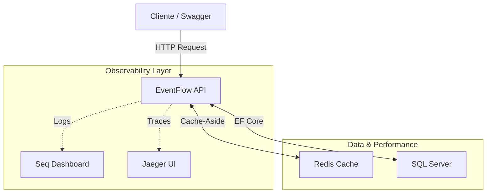

# EventFlow API — Enterprise Event Management

O **EventFlow API** é uma solução de back-end **robusta, escalável e orientada a produção** para gestão de eventos, desenvolvida em **.NET 8** e estruturada segundo os princípios da **Clean Architecture**.

Diferente de APIs tradicionais voltadas apenas a CRUD, este projeto foca fortemente em **Observabilidade, Performance e Resiliência**, simulando um ambiente real de produção com **tracing distribuído**, **logs estruturados** e **estratégias de cache**.

---

## Arquitetura & Design

O projeto foi refatorado para suportar **alta carga**, **baixo acoplamento** e **manutenibilidade a longo prazo**.



---

## 🌟 Diferenciais Técnicos

### ⚡ Cache Distribuído (Redis)
- Implementação do padrão **Cache-Aside**
- Redução significativa de latência em operações de leitura (ex: `GetById`)
- Estratégias de **invalidação de cache** para garantir consistência dos dados

### 🔍 Observabilidade Completa

- **Tracing Distribuído** *(OpenTelemetry + Jaeger)*  
  Rastreamento ponta-a-ponta das requisições para identificar gargalos entre **API, Cache e Banco de Dados**.

- **Logs Estruturados** *(Serilog + Seq)*  
  Centralização de logs para diagnóstico rápido em ambientes containerizados.

### 🛡️ Resiliência
- Políticas de **Retry** na conexão com o banco de dados
- Tolerância a falhas transientes

### 🐳 Containerização
- Ambiente totalmente orquestrado via **Docker Compose**:
  - API
  - SQL Server
  - Redis
  - Jaeger
  - Seq

### 🧼 Clean Code
- Uso de **Primary Constructors**
- **Extension Methods** para configuração de DI (`AppConfiguration`)
- Separação estrita de responsabilidades entre camadas

---

## Tech Stack

| Categoria | Tecnologias |
|---------|------------|
| **Core** | .NET 8, C# 12 |
| **Arquitetura** | Clean Architecture, RESTful, Dependency Injection |
| **Banco de Dados** | SQL Server 2022, Entity Framework Core 8 |
| **Performance** | Redis (StackExchange.Redis), Microsoft.Extensions.Caching |
| **Observabilidade** | OpenTelemetry, Jaeger, Serilog, Seq |
| **Documentação** | Swagger / OpenAPI (com suporte a Auth) |
| **Qualidade** | xUnit, Moq, FluentAssertions, FluentValidation |
| **DevOps** | Docker, Docker Compose |

---

## Como Rodar o Projeto

A forma **mais simples e profissional** de executar o EventFlow API é utilizando **Docker**, que sobe toda a infraestrutura necessária automaticamente.

### Pré-requisitos

- [Docker Desktop](https://www.docker.com/products/docker-desktop/) instalado.

### Passo a Passo

```bash
git clone https://github.com/alysonsz/eventflow-api.git
cd eventflow-api
```

```bash
docker-compose up -d --build
```

Aguarde alguns segundos até que todos os containers estejam prontos.

---

## Acesso aos Serviços

| Serviço | URL | Descrição | Credenciais (se houver) |
|-------|-----|-----------|-------------|
| **Swagger** | http://localhost:8079/swagger | Documentação e testes da API | - |
| **Jaeger UI** | http://localhost:16686 | Tracing e análise de performance | - |
| **Seq Logs** | http://localhost:5341 | Logs estruturados em tempo real | User: `admin` <br> Pass: `MyStrongPassword123!` |

---

## 🧪 Testando a Performance (Cache)

1. Acesse o **Swagger**
2. Execute `GET /event/{id}` (primeira chamada → SQL Server)
3. Execute a mesma requisição novamente

**Resultado:**
- A segunda resposta ocorre em **milissegundos**, pois vem do **Redis**

Vá até o **Jaeger UI** e compare os *spans* das duas requisições.

---

## 📂 Estrutura do Projeto

```
EventFlow API
├── 📁 EventFlow.Core           # Domínio (Entidades, Interfaces, DTOs)
├── 📁 EventFlow.Application    # Regras de Negócio (Services, Validations, Cache Logic)
├── 📁 EventFlow.Infrastructure # Acesso a Dados (EF Core, Repositories, Migrations)
├── 📁 EventFlow.Presentation   # API (Controllers, Docker, DI Setup)
└── 📁 EventFlow.Tests          # Testes Unitários (xUnit)
```

---

## 🔐 Autenticação

A API utiliza **JWT (JSON Web Token)**.

1. Crie uma conta em: `POST /authentication/register`
2. Faça login em: `POST /authentication/login`
3. Copie o token retornado
4. No Swagger, clique em **Authorize** e informe:

```
SEU_TOKEN
```

---

### 👨‍💻 Autor

Desenvolvido por **Alyson Souza Carregosa**  
Focado em **Engenharia de Software de Alta Performance**, Arquitetura e Sistemas Observáveis.

---

## 📄 Licença

Este projeto está licenciado sob a **MIT License**.

